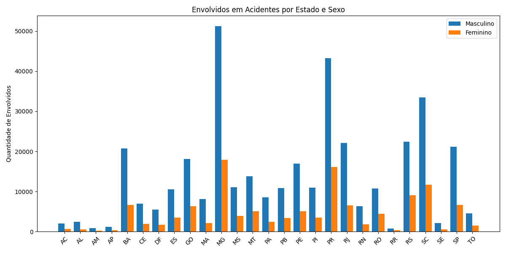
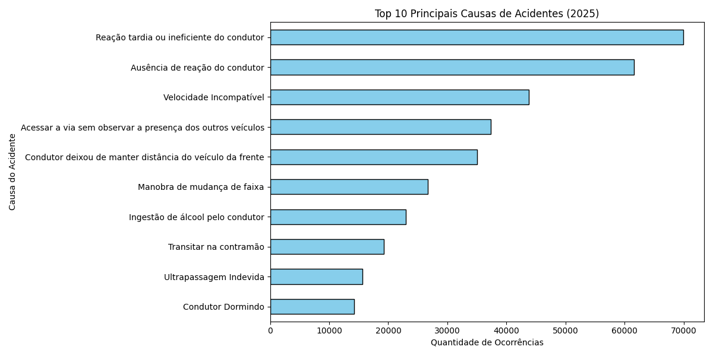
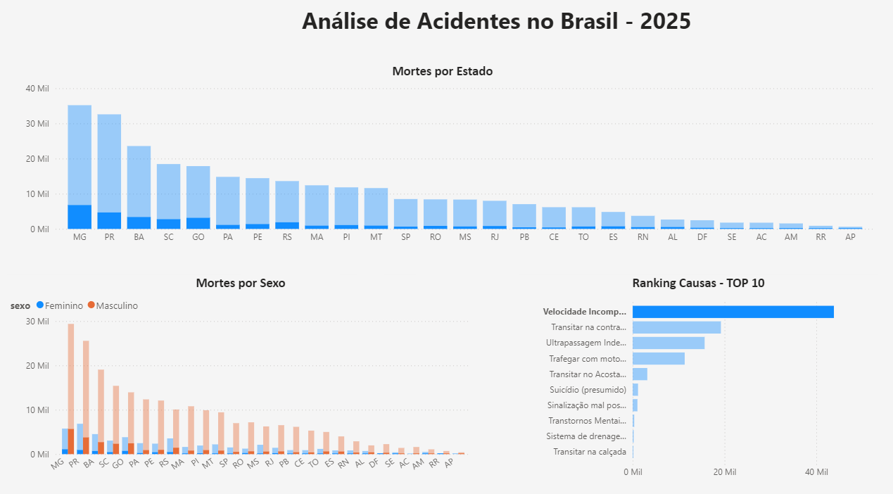

# 📊 Análise de Acidentes no Brasil - 2025

## Sobre o projeto
Este projeto tem como objetivo analisar dados de acidentes no Brasil, utilizando Python para tratamento e exploração dos dados e Power BI para criação de dashboards interativos.

O foco foi transformar dados brutos em informações visuais claras, permitindo identificar padrões e gerar insights relevantes.

---

## Tecnologias utilizadas
- Python
- Pandas
- Matplotlib
- Power BI

---

## 🐍 Análise com Python
Durante o desenvolvimento, foi realizada uma análise exploratória utilizando Python.

Foram utilizadas:
- **Pandas** para leitura, limpeza e manipulação dos dados  
- **Matplotlib** para geração de gráficos exploratórios  

Esses gráficos foram utilizados para entender os padrões dos dados antes da construção do dashboard no Power BI.

### Gráficos gerados no Python

#### Envolvimento em Acidentes por Estado e Sexo

#### Top 10 Causas de Acidentes

---

## Dashboard no Power BI
Após o tratamento dos dados, foi desenvolvido um dashboard interativo no Power BI para visualização das informações.

---

## 🔍 Etapas do projeto
- Leitura do arquivo CSV
- Seleção das colunas relevantes
- Limpeza dos dados (remoção de valores como "Não Informado" e "Ignorado")
- Tratamento de valores nulos
- Agrupamento por estado e sexo
- Análise das principais causas de acidentes
- Criação de gráficos exploratórios em Python
- Construção do dashboard no Power BI

---

## 📊 Análises realizadas
- Mortes por estado  
- Comparação de mortes por sexo  
- Ranking das principais causas de acidentes  

---

##  Insights obtidos
- Alguns estados concentram maior número de mortes  
- O número de vítimas do sexo masculino é significativamente maior  
- Estados como MG, PR e BA apresentam maior concentração de mortes 

---

##  Dados
O dataset utilizado foi o arquivo **"acidentes2025.csv"**, baseado em dados públicos da Polícia Rodoviária Federal (PRF).

Devido ao tamanho do arquivo, ele não foi incluído neste repositório.

🔗 Dataset original: https://www.gov.br/prf/pt-br/acesso-a-informacao/dados-abertos/dados-abertos-da-prf

Planilha - Documento CSV de Acidentes 2026 (Agrupados por pessoa - Todas as causas e tipos de acidentes)

---

